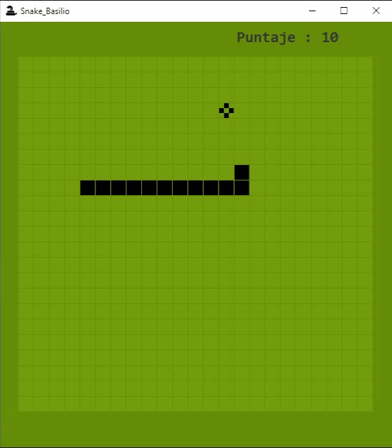

# TP de Ingeniería de Software: Snake.

#### Profesores:
+ Figueroa, Sergio
+ Páez, Danilo

#### Integrantes:
+ Fernández, Gastón Emanuel
+ Guimpelevich, Maria Luján
+ Trujillo, David
+ Venecia, Milagros Ailín

#### Acerca del Juego:
- Se mueve con las teclas A,W,S,D.
- El juego actualiza el puntaje e incrementa la velocidad cada vez que la serpiente come.

---
   [DocumentoCompartido](https://docs.google.com/document/d/1dT5LHnEcWymInrpFc9QiyCVPoj7InfkuSXXEfz3gg00/)

---
#### Nota :
Este proyecto se desarrolló siguiendo este video https://youtu.be/Fh5fFE5h8tw pero agregando nuevas funcionalidades para mejorarlo.
